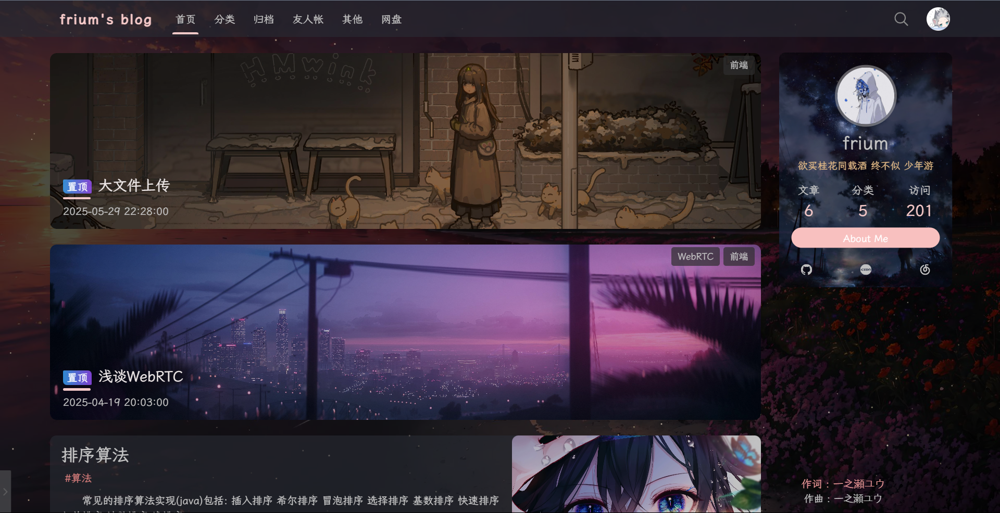
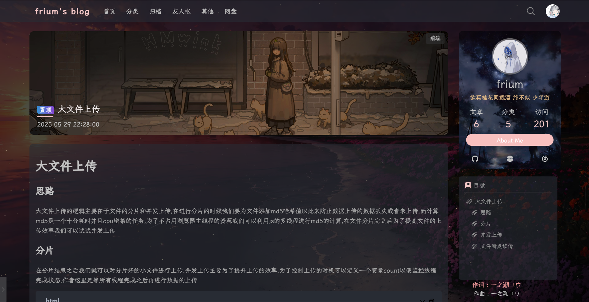
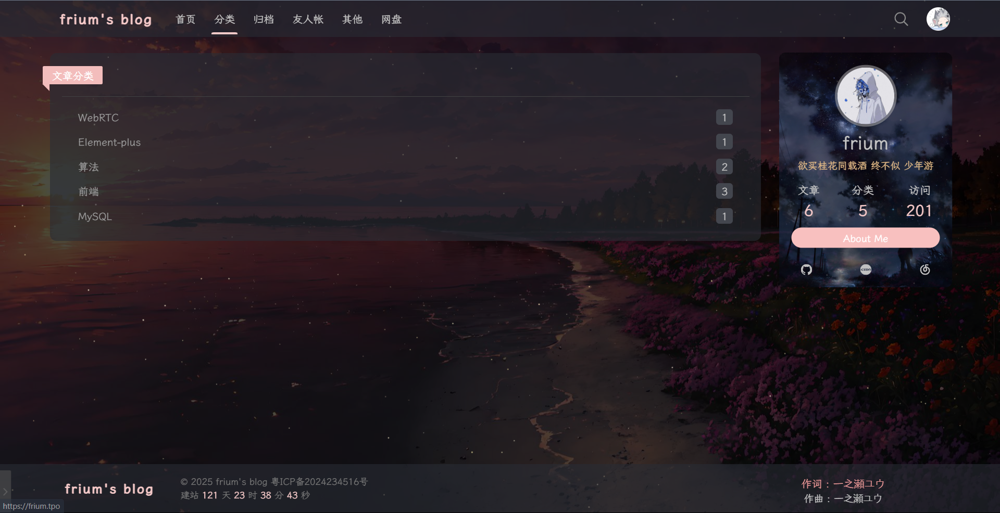
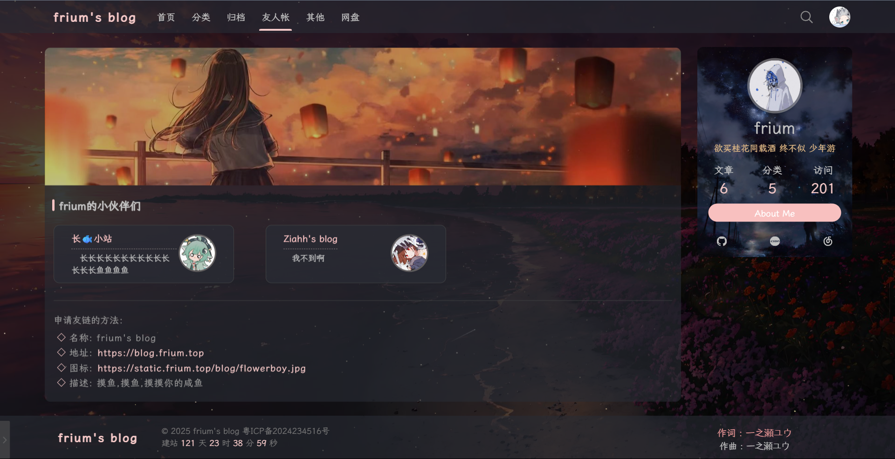
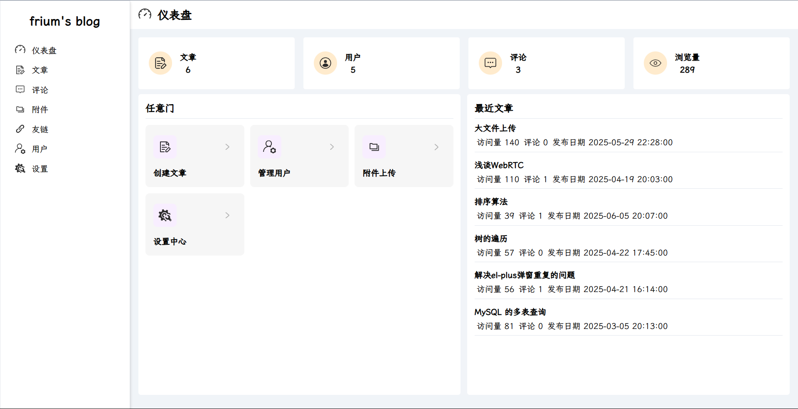
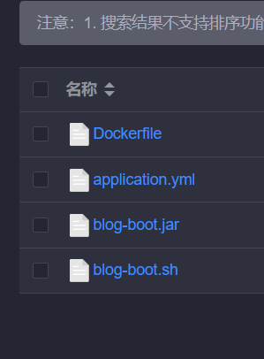
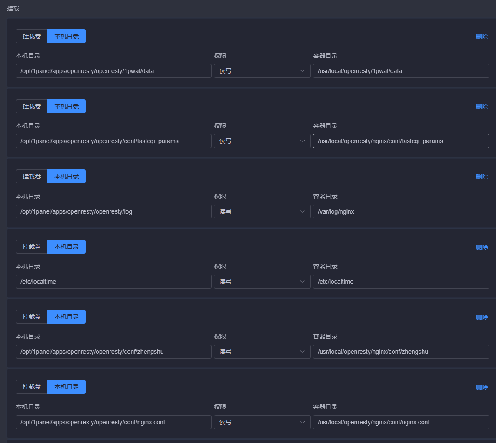
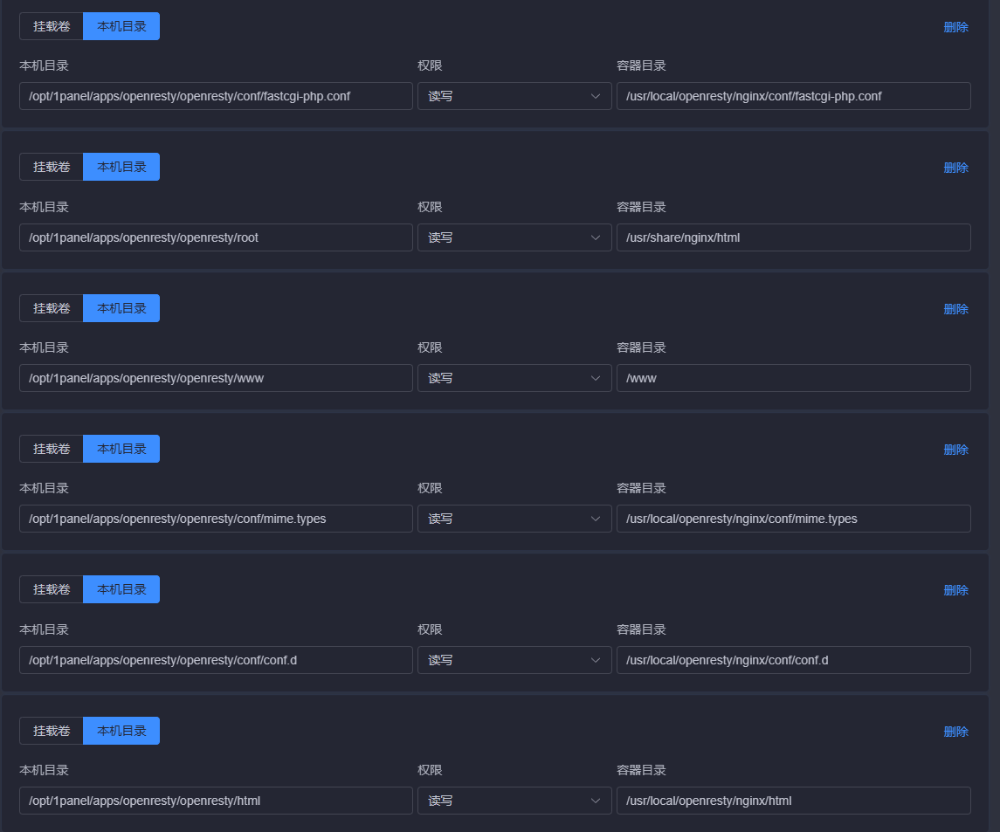

# frium's blog --- 星空主题个人博客

访问地址:[frium's blog](https://blog.frium.top/)

## 前言

- 开源不易，希望大家**star**支持一下
- 本人主要是前端开发 项目目前更新到此 后续会根据issue问题进行修改更新, 有问题可以提issue， 同时也欢迎大家来共建此项目，包括但不限于：bug 修复、代码优化、功能开发等等

## 效果图









后台登录地址(需要先在博客首页登录获取信息): /admin



## 相关技术栈

### 前端:

- 基础框架：vue3
- 状态管理：pinia
- 路由组件：vue-router
- 网络请求：axios

### 后端：

- 基础框架：springboot
- ORM框架：mybatisplus
- 权限框架：springsecurity
- 缓存中间件：redis
- 消息中间件：rabbitmq
- 数据库: mysql

## 部署

本项目采用docker部署 在部署之前请先安装并配置好docker  这边十分建立使用1panel进行安装接下来需要的容器(这样部署的时候文件路径不会出现很大的问题)

拉取项目

```
git clone https://github.com/frium/blog.git
```

进入blog-vue目录

```
pnpm i;
pnpm build;
```

进入blog-boot目录

```
mvn package;
```

服务器创建好文件夹

1. **/opt/1panel/apps/openresty/openresty/html/static/blog**
2. **/opt/1panel/apps/openresty/openresty/html/blog/blog-vue**
3. **/home/java/blog**

将刚刚生成的dist文件放在**/opt/1panel/apps/openresty/openresty/html/blog/blog-vue**下
部署项目文件结构如下 所有文件放在**/home/java/blog**
将刚才生成的jar放在这个目录里面(注意名字是**blog-boot.jar**)



### Dockerfile文件如下

记得要需要先拉取jdk17镜像

```dockerfile
# 第一行必须指定基础容器，我们是java项目，运行需要jdk支撑
FROM openjdk:17

# 将 JAR 文件添加到容器中
ADD blog-boot.jar blog-boot.jar

# 将 application.yml 添加到容器中
ADD application.yml /app/application.yml

# 镜像启动容器后暴露的端口
EXPOSE 1024

# 设置 Spring Boot 使用自定义的 application.yml
ENTRYPOINT ["java", "-Dspring.config.location=file:/app/application.yml", "-jar", "blog-boot.jar"]

# 设置时区
ENV TZ=Asia/Shanghai
RUN ln -snf /usr/share/zoneinfo/$TZ /etc/localtime

```

### blog-boot.sh (脚本文件)

```sh
CONTAINER_NAME="blog-boot"
IMAGE_NAME="blog-boot"  # 替换为实际的镜像名称
NEW_IMAGE_TAG="latest"        # 新镜像的标签
CUSTOM_PORT="1024"

# 停止并删除名为**** 的容器
echo "Stopping and removing the container: $CONTAINER_NAME..."
docker stop $CONTAINER_NAME
docker rm $CONTAINER_NAME

# 查找并删除该容器使用的镜像
echo "Removing the image: $IMAGE_NAME..."
docker rmi $IMAGE_NAME:$NEW_IMAGE_TAG

# 从 Dockerfile 构建新的镜像
echo "Building the new image: $IMAGE_NAME:$NEW_IMAGE_TAG..."
docker build -t $IMAGE_NAME:$NEW_IMAGE_TAG .

# 使用新的镜像运行新的容器
echo "Running the new container: $CONTAINER_NAME..."
docker run -d --name $CONTAINER_NAME -p $CUSTOM_PORT:80 -v /opt/1panel/apps/openresty/openresty/html/static/blog:/opt/1panel/apps/openresty/openresty/html/static/blog $IMAGE_NAME:$NEW_IMAGE_TAG


echo "Operation completed!"
```

### 后端application.yml文件如下

```yml
server:
  port: 80
spring:
  servlet:
    multipart:
      max-file-size: 50MB
      max-request-size: 50MB
  rabbitmq:
    host: #地址
    port: #端口
    username: #用户名
    password: #密码
    listener:
      simple:
        retry:
          enabled: true
          max-attempts: 3
          initial-interval: 3000
  datasource:
    hikari:
      max-lifetime: 300000  # 5分钟（默认30分钟太长）
      connection-timeout: 30000
      validation-timeout: 5000
      leak-detection-threshold: 60000
      connection-test-query: SELECT 1
    url: #mysql url
    username:  #用户名
    password: #密码
    driver-class-name: com.mysql.cj.jdbc.Driver
  data:
    redis:
      host: #ip
      port: #端口
      password: #密码
      database: 1
  mail:
    default-encoding: UTF-8
    host: smtp.qq.com
    protocol: smtps
    port: 465
    username: 877385364@qq.com
    password: #发送qq邮箱的密码配置
    properties: # 配置以SSL的方式发送, 这个需要使用这种方式并且端口是465
      mail:
        smtp:
          auth: true
          ssl:
            enable: true
            socketFactory:
              class: com.sun.mail.util.MailSSLSocketFactory
              fallback: false

mybatis-plus:
  configuration:
    #在映射实体或者属性时，将数据库中表名和字段名中的下划线去掉，按照驼峰命名法映射fg
    map-underscore-to-camel-case: true
    log-impl: org.apache.ibatis.logging.stdout.StdOutImpl
  global-config:
    db-config:
      id-type: auto
jwt:
  key: #jwt的key
  ttl: 604800000
  name: Authorization

ecs:
  user: #服务器用户名
  ip: #服务器ip
  password: #服务器密码
  path: #文件存储路径
  directoryPath: #文件存储路径
  port: 22
  exposePath: #文件访问路径 如https://static.frium.top/blog/

visit:
  uv: website:uv
  pv: website:pv
```

### nginx(openresty)挂载





### nginx(openresty)文件配置

```nginx
 server {
        listen       80;
        server_name  static.frium.top; //替换成你的静态文件域名
        return 307 https://$host$request_uri;
    }
    server {
        charset utf-8;
        listen       443 ssl;
        server_name  static.frium.top; //替换成你的静态文件域名
        ssl_certificate   // fullchain.cer证书地址
        ssl_certificate_key // cert.key证书地址

        ssl_session_cache    shared:SSL:1m;
        ssl_session_timeout  5m;

        ssl_ciphers  HIGH:!aNULL:!MD5;
        ssl_prefer_server_ciphers  on;

        ssl_protocols TLSv1 TLSv1.1 TLSv1.2;
        
         location /blog/ {
            root /usr/local/openresty/nginx/html/static/; //文件路径
            autoindex on;
            autoindex_exact_size off;
            autoindex_localtime on; 
        }
       
      }
      
			server {
			    listen 80;
			    server_name blog.frium.top; //替换成你的博客域名
			    return 301 https://$host$request_uri;
			}
			

			server {
			    listen 443 ssl;
			    server_name blog.frium.top;
			    ssl_certificate // fullchain.cer证书地址
			    ssl_certificate_key // cert.key证书地址
			    ssl_session_cache shared:SSL:1m;
			    ssl_session_timeout 5m;
			    ssl_ciphers HIGH:!aNULL:!MD5;
			    ssl_prefer_server_ciphers on;
			
			    location / {
			        root /usr/local/openresty/nginx/html/blog/blog-vue/dist; //前端dist包文件
			        try_files $uri $uri/ /index.html;
			        index index.html;
			    }
			
			    location = /api/file/uploadFile {
			        if ($request_method = 'OPTIONS') {
			            add_header 'Access-Control-Allow-Origin' '$http_origin';
			            add_header 'Access-Control-Allow-Methods' 'POST, OPTIONS';
			            add_header 'Access-Control-Allow-Headers' 'Content-Type, Authorization';
			            add_header 'Access-Control-Expose-Headers' 'Content-Length, X-Progress';
			            add_header 'Access-Control-Max-Age' 1728000;
			            add_header 'Content-Type' 'text/plain charset=UTF-8';
			            add_header 'Content-Length' 0;
			            return 204;
			        }
			
			        proxy_pass http://127.0.0.1:1024/file/uploadFile;
			        
			        proxy_request_buffering off;
			        proxy_buffering off;
			        proxy_max_temp_file_size 0;
			        
			        proxy_http_version 1.1;
			        proxy_set_header Connection "";
			        proxy_set_header Host $host;
			        proxy_set_header X-Real-IP $remote_addr;
			        proxy_set_header X-Forwarded-For $proxy_add_x_forwarded_for;
			        proxy_set_header X-Forwarded-Proto $scheme;
			        
			        proxy_set_header Accept-Encoding "";
			        add_header 'Access-Control-Expose-Headers' 'Content-Length, X-Progress';
			        
			        client_max_body_size 500M;
			        client_body_buffer_size 512k;
			        client_body_temp_path /tmp/nginx_upload_temp 1 2;
			        
			        proxy_read_timeout 1800;
			        proxy_connect_timeout 60;
			        proxy_send_timeout 1800;
			    }
			
			    location /api/ {
			        proxy_pass http://127.0.0.1:1024/;
			        proxy_http_version 1.1;
			        proxy_set_header Connection "";
			        proxy_set_header Host $host;
			        proxy_set_header X-Real-IP $remote_addr;
			        proxy_set_header X-Forwarded-For $proxy_add_x_forwarded_for;
			        proxy_set_header X-Forwarded-Proto $scheme;
			    }
			}
```

配置好之后在**/home/java/blog** 运行**./blog-boot.sh**命令

## 联系方式

1. qq: 877385364
2. wx: Frium_